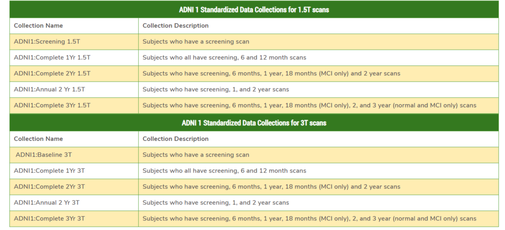

Prerequisites for running script:

- Have Long Paths enabled. Helpful link I followed: https://www.howtogeek.com/266621/how-to-make-windows-10-accept-file-paths-over-260-characters/
- Have all Image folders downloaded in into one parent folder from ROSIE
- Have standardized lists downloaded from ROSIE
- Update script to reflect your paths

